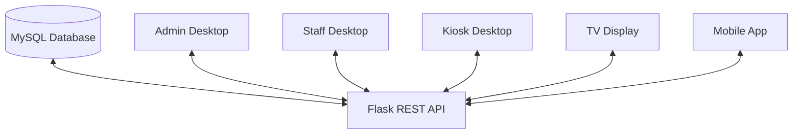

# System Architecture

Every client uses HTTP API endpoints. MySQL is accessible only to the Flask
backend. Staff queue actions are resolved from the authenticated user's active
shift, so the desktop client does not submit a staff ID or window ID when it
calls the next customer.
