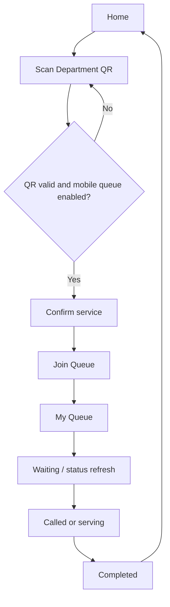

# Mobile UI Flow

## Purpose

The PCDS Queue Mobile App is a student/customer client. It does not require a
student login, registration, password, profile, or an in-app settings screen.
It uses a device identifier to keep one active mobile ticket per department.

## Navigation

The persistent bottom navigation contains only **Home** and **My Queue**. The
My Queue item is enabled after a ticket has been created or restored.

## Screens

### Home

- PCDS Queue branding and server status
- Primary **Scan Department QR** action
- Existing active ticket summary, when present
- QR is the primary way to determine the service department

### Scan QR

- Camera permission handling through `expo-camera`
- QR-only scanner frame
- Backend validation of QR existence, status, expiration, department status,
  and mobile-queue availability

### Confirm Service

The confirmation screen appears only after a valid QR is scanned. It displays:

- Department name and queue prefix
- Current serving number
- Waiting count
- Active windows
- Queue availability notices
- **Join Queue** action

Scanning a QR does not create a queue number. The queue is created only after
the customer selects **Join Queue**.

### My Queue

- Queue number and department
- Waiting, called, serving, completed, cancelled, or no-show status
- People ahead and estimated wait while waiting
- Current serving number and assigned window when called
- Automatic status refresh
- Optional local status-alert permission
- Cancel action while the ticket is waiting

### Completed

When staff completes the ticket, the ticket view shows its final completed
status and a **Done** action that returns the customer to Home.

## API connection

The implemented mobile application uses the Flask API directly through
`mobile/PCDSQueueMobile/services/api.ts`:

| Purpose | Endpoint |
| --- | --- |
| Validate QR | `GET /api/qr/validate/{token}` |
| Read department service information | `GET /api/queue/status/{department_id}` |
| Join queue | `POST /api/queue/generate` with source `MOBILE` |
| Refresh ticket | `GET /api/queue/{queue_id}/status` |
| Cancel ticket | `POST /api/queue/{queue_id}/cancel` |

For a physical phone, configure `EXPO_PUBLIC_API_URL` at build time with the
Flask server's campus-LAN or HTTPS address. `127.0.0.1` refers to the phone
itself and must not be used for a remote API server.
